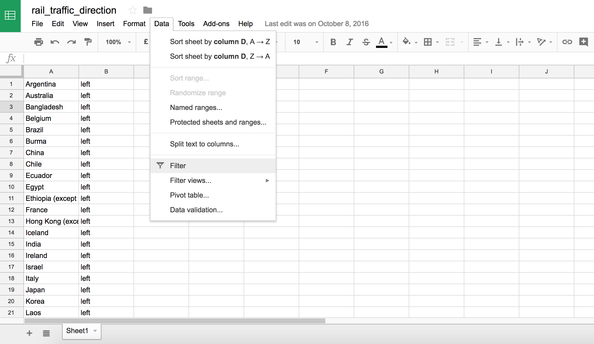

## Jak wydobyć informacje z danych?


## Wczytanie danych

Do **R** można łatwo wczytywać dane z arkuszy kalkulacyjnych (.csv., .xls, .odt).

```{r}
mieszkania <- read.csv("mieszkania_wroclaw_ceny.csv", 
                       encoding = "UTF-8")
```

Do zmiennej *mieszkania* przypisaliśmy wynik funkcji *read.csv*.

## Obiekty

```{r}
# wymiary tabeli
dim(mieszkania)

# pierwsze wiersze z tabeli
head(mieszkania)
```

## Obiekty

```{r}
# podsumowanie tabeli
summary(mieszkania)
```

## 



## Różne typy danych

```{r}
# typ numeryczny (numeric)
mieszkania[5:10, "n_pokoj"]

# typ czynnikowy (factor)
mieszkania[5:10, "dzielnica"]
```

# Przetwarzanie danych

## Filtrowanie wierszy

```{r, message=FALSE, warning = FALSE}
library(dplyr)
filter(mieszkania, dzielnica == "Stare Miasto")
```

##

Warunki mozna łączyć

```{r}
filter(mieszkania, dzielnica == "Stare Miasto", rok == 2017)
```

## Co jeszcze potrafi dplyr? Może nie interesuje nas nic poza ceną i dzielnicą?

```{r}
select(mieszkania, dzielnica, cena_m2)
```

##

Te komendy można ze sobą łączyć w tak zwane strumienie (pipes).

```{r}
mieszkania %>%
  filter(dzielnica == "Śródmieście") %>%
  select(dzielnica, pietro, cena_m2)
```

## Co potrafimy już zrobić?

* wybrać poszczególne wiersze za pomocą warunków logicznych (filter)
* wybrać poszczególne kolumny (select)

# Podsumowania

## 

Interesować nas może podsumowanie. Np. ile średnio kosztują mieszkania w zależności
od liczby pokojów lub piętra.

```{r}
mieszkania %>%
  group_by(n_pokoj) %>%
  summarise(srednia_cena = mean(cena_m2))
```

##

Jak wiadomo jeden wykres znaczy więcej niż tysiąc tabel. Zróbmy zatem prostą wizualizację.

```{r, message=FALSE, warning=FALSE}
library(ggplot2)
srednia_cena_pokoje <- mieszkania %>%
  group_by(n_pokoj) %>%
  summarise(srednia_cena = mean(cena_m2))
```

## 

Mówimy jak ma wyglądać wykres. Chcemy użyć danych z *srednia_cena_dzielnice*,
na osi x(poziomej) chcemy mieć liczbę pokojów, a na osi y (pionowej)
ich średnią cenę. Zaznaczmy wartości na wykresie za pomocą słupków.

```{r, eval = FALSE}
ggplot(srednia_cena_pokoje, aes(x = n_pokoj, y = srednia_cena))
```

##

```{r, eval = T}
ggplot(srednia_cena_pokoje, aes(x = n_pokoj, y = srednia_cena)) +
  geom_bar(stat = "identity")
```

## Zadania

1. Odfiltruj jedynie nieruchomości z Psiego Pola o liczbie pokojów większej niż 2
2. Odfiltruj nieruchomości z Krzyków i wyświetl jedynie informacje o piętrze, na którym
znajduje się mieszkanie i liczbie pięter w budynku
3. Znajdź średnią cenę $m^2$ w każdej dzielnicy
4. Narysuj wykres słupkowy, na którym przedstawisz cenę $m^2$ w każdej dzielnicy