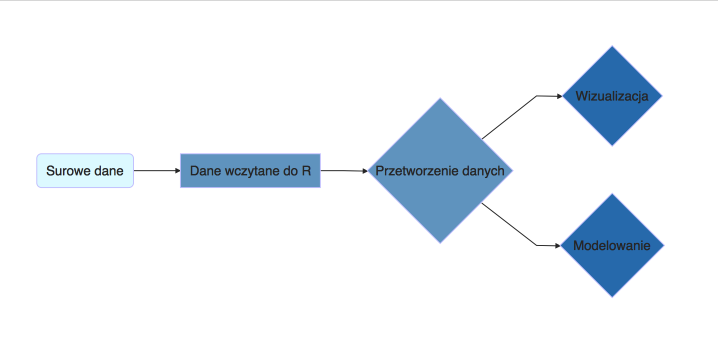

## Ładowanie pakietów

```{r, message=FALSE, warning = FALSE}
library(dplyr)
library(tidyr)
library(ggplot2)
library(ggthemes)
```


## Skąd brać informacje?

* google (zwykle odpowiedzi na stack overflow)
* dokumentacja
* ,,ściągawka" https://github.com/rstudio/cheatsheets/raw/master/data-transformation.pdf
* grupa STWUR na facebooku

## Jak wydobyć informacje z danych?



## 

```{r wczytanie_danych}
mieszkania <- read.csv("mieszkania_wroclaw_ceny.csv")
```

Najpierw sprawdźmy co w ogóle jest w tych danych

```{r struktura}
str(mieszkania)
```

##

```{r}
head(mieszkania)
```

##

```{r podstawowe_statystyki}
summary(mieszkania)
```

## Różne typy danych

```{r}
# typ numeryczny (numeric)
mieszkania[5:10, "n_pokoj"]

# typ czynnikowy (factor)
mieszkania[5:10, "dzielnica"]
```

## Co już znamy?

```{r}
mieszkania %>% 
  group_by(dzielnica) %>% #grupujemy obserwacje
  summarise(sredni_metraz = mean(metraz)) #osobno w każdej grupie liczymy średnią
```

## Co już znamy?

```{r}
mieszkania %>%
  filter(dzielnica == "Śródmieście") %>% #filtrujemy wiersze
  select(dzielnica, pietro, cena_m2) %>% #wybieramy zmienne
	head
```

# Przekształcanie danych

## Wyfiltrujemy dane z brakiem informacji o dzielnicy

```{r}
mieszkania <- mieszkania %>%
  filter(! dzielnica == "Brak")
```


##

```{r}
mieszkania %>% 
	select(dzielnica, metraz, cena_m2) %>% #wybieramy zmienne
	head
```

O co chodzi ze znaczkiem **%>%**, jest to tak zwany operator strumieniowy (pipe).
To co jest po lewej stronie staje się pierwszym argumentem funkcji po prawej stronie.

## Jak tworzyć nowe zmienne?

Służy do tego funkcja **mutate**

```{r mutate_parter}
mieszkania %>% 
	mutate(czy_parter = pietro == 0) %>%
  select(dzielnica, pietro, czy_parter) %>%
  head(11)
```

# Sortowanie

## Chcemy je uszeregować od najniższej do najwyższej wartości

```{r dzielnice_posortowane}
mieszkania %>% 
  group_by(dzielnica) %>%
	summarize(cena_m2 = mean(cena_m2)) %>%
  arrange(cena_m2)
```

## Ile mamy ofert w poszczególnych dzielnicach

```{r zliczanie_obserwacji}
mieszkania %>% 
  group_by(dzielnica) %>%
	summarize(liczba_ofert = n()) %>%
  arrange(liczba_ofert)
```

## Mogą nas interesować wartości ekstremalne, np. 5 z najwyższą ceną

```{r}
mieszkania %>% 
  top_n(5, wt = cena_m2)
```

## Najdroższe w dzielnicach

```{r top_w_dzielnicach}
mieszkania %>% 
  group_by(dzielnica) %>%
  top_n(2, wt = cena_m2) %>% ungroup %>%
  arrange(dzielnica, cena_m2)
```

## Zadania:

1. Wybierz mieszkania, których powierzchnia jest większa niż 60 metrów i przypisz je 
do nowej zmiennej
1. Posortuj mieszkania po liczbie pokojów
2. Posortuj mieszkania ze Starego Miasta po metrażu
1. Znajdź średnią cenę $m^2$ w całym Wrocławiu
3. Stwórz nową zmienną opisującą cenę całkowitą mieszkania
1. Wyświetl ofertę o najwyższej cenie za m2 poza Starym Miastem
2. Jak jest średnia cena mieszkań większych niz 60 m2?
3. Jaka jest przeciętna powierzchnia w zależności od piętra? Z czego może ona wynikać?

# Łączenie zbiorów danych

## Łączenie zbiorów danych

> * Oprócz przetwarzania jednego zbioru danych możemy chcieć go zestawić
z innym zbiorem.
> * Dla mieszkań, moglibyśmy chcieć zestawić je z liczbą mieszkańców

```{r}
ludnosc <- read.csv("data/ludnosc_wroclaw.csv")
ludnosc
```

## 

> * Chcemy połączyć te informacje z tabelą z mieszkaniami
> * Każde mieszkanie chcemy połączyć z odpowiadającą dzielnicy
informacją o liczbie mieszkańców
> * W tym celu musimy znaleźć wspólną zmienną obu tych zbiorów danych

## Zobaczmy jeszcze raz, jak wyglądają dane mieszkaniowe

```{r}
head(mieszkania)
```

## 

Taką operację wykonujemy za pomocą funkcji **inner_join**. Chcemy, żeby
kolumna *dzielnica* w ramce danych *mieszkania* odpowiadały kolumnie
*Dzienica* w ramce danych *ludnosc*

```{r, warning=FALSE}
mieszkania %>%
  inner_join(ludnosc, by = c("dzielnica"="Dzielnica")) %>%
  head
```

## 

Mamy informację zarówno o mieszkaniach, jak i o dzielnicach, w których się znajdują.

```{r, warning=FALSE}
mieszkania %>%
  group_by(dzielnica) %>%
  summarise(liczba_ofert = n()) %>%
  inner_join(ludnosc, by = c("dzielnica"="Dzielnica"))
```


## Zadania:

1. Posortuj dzielnice po liczbie mieszkańców
4. Ile ofert przypada na jednego mieszkańca w poszczególnych dzielnicach?
3. Posortuj dzielnice po liczbie ofert przypadających na jednego mieszkańca
4. Ile $m^2$ przypada na jednego mieszkańca w poszczególnych dzielnicach?

## 

Widzimy, które dzielnice mają bardziej charakter ,,lokalny", a które są
w większym stopniu zamieszkane przez osoby przyjezdne.

```{r, warning=FALSE}
mieszkania %>%
  group_by(dzielnica) %>%
  summarise(liczba_ofert = n()) %>%
  inner_join(ludnosc, by = c("dzielnica"="Dzielnica")) %>%
  mutate(liczba_ofert/liczba_mieszkancow)
```

## Różnica ze średnią cena m2 w dzielnicy

```{r srednia}
mieszkania %>% 
  group_by(dzielnica) %>%
	mutate(srednia_cena_m2 = mean(cena_m2)) %>%
  ungroup %>%
  mutate(roznica = cena_m2 - srednia_cena_m2) %>%
  select(dzielnica, cena_m2, srednia_cena_m2, roznica) %>%
  head
```


## Zadania

1. Znajdź różnicę w cenie $m^2$ między dzielnicami a średnią dla Wrocławia
1. Znajdź w poszczególnych dzielnicach mieszkania, które najbardziej różnią
się od średniej ceny $m^2$
2. Wybierz losowo 10 mieszkań ze zbioru danych (funkcja **sample_n**)
3. Jaka jest powierzchnia mieszkań do kupienia w stosunku do liczby mieszkańców
w każdej dzielnicy?